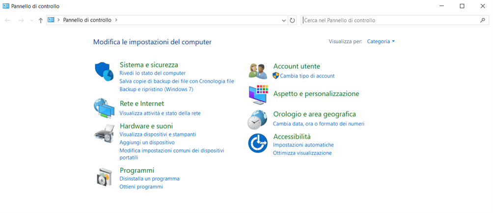

# Supporto IT — Knowledge base ADCO HUB

Sito con le guide del supporto IT e **Helpo**, l'assistente AI di primo livello.
Le pagine sono HTML, CSS e JavaScript senza build; su Vercel si aggiungono il
controllo di accesso (`middleware.js`) e tre funzioni server in `api/`.

## Struttura

```
supporto-it/
├── index.html          Home: ricerca, categorie, guide aggiornate di recente
├── categoria.html      Elenco delle guide di una categoria (?cat=id-categoria)
├── articolo.html       Singola guida (?id=id-articolo)
├── ricerca.html        Risultati della ricerca classica (?q=termini)
├── contatti.html       Canali, orari, priorità (i recapiti arrivano da KB.contatti)
├── ai-mode.html        Conversazione con Helpo
├── statistiche.html    Feedback su Helpo (area IT): voti, domande senza guida, commenti
├── login.html          Pagina di accesso
├── login-it.html       Secondo accesso, riservato all'ufficio IT
├── favicon.ico         Icona del sito (16, 32, 48 px, ricavata dal logo)
├── middleware.js       Controllo di accesso lato server (Vercel)
├── vercel.json         Include l'archivio nella funzione di Helpo, durata massima 30 s
├── package.json        Dipendenza del middleware e comando dei test
├── api/
│   ├── login.js        Verifica credenziali e rilascia il cookie di sessione
│   ├── logout.js       Chiude la sessione (anche quella dell'area IT)
│   ├── login-it.js     Verifica la password dell'area IT
│   ├── logout-it.js    Chiude solo la sessione dell'area IT
│   ├── chat.js         Helpo: validazione, istruzioni, chiamata a OpenAI, fonti
│   └── feedback.js     Salva i voti su Helpo e restituisce le statistiche
├── lib/
│   ├── knowledge-base.js  Carica assets/js/data.js sul server
│   ├── retrieval.js       Scelta delle guide da passare a Helpo
│   ├── store.js           Archivio del feedback (Upstash Redis)
│   └── area-it.js         Sessione dell'area IT (stessa firma usata in middleware.js)
├── tests/
│   └── helpo.test.js   Test automatici (npm test)
└── assets/
    ├── css/style.css   Unico foglio di stile del sito
    ├── img/            Logo e immagini delle guide
    └── js/
        ├── data.js     TUTTI i contenuti: categorie, guide e contatti
        ├── app.js      Rendering delle pagine e ricerca classica
        ├── chat.js     Interfaccia di Helpo nel browser, con 👍/👎
        └── statistiche.js  Pagina delle statistiche
```

## Accesso

Il sito è protetto **lato server** quando è pubblicato su Vercel. Ogni richiesta
passa da `middleware.js`: senza un cookie di sessione valido il visitatore viene
portato a `login.html` e non riceve nulla del sito, né le pagine né i contenuti
in `assets/`. Restano pubblici solo la pagina di accesso, il foglio di stile,
`favicon.ico` e `robots.txt`. Le chiamate a `/api/chat` con la sessione scaduta
ricevono un errore JSON 401 invece del reindirizzamento.

### Variabili da impostare su Vercel

In *Project Settings → Environment Variables*. Vanno attivate per **Production**
oltre che per Preview: una variabile presente solo in Preview fa funzionare la
preview ma non il sito pubblicato.

| Variabile        | Valore                                                          |
|------------------|-----------------------------------------------------------------|
| `SITO_UTENTE`    | nome utente (facoltativa: se assente vale `ADC`)                |
| `SITO_PASSWORD`  | la password di accesso                                          |
| `SITO_SEGRETO`   | una stringa casuale lunga, usata per firmare il cookie          |
| `OPENAI_API_KEY` | chiave per le risposte di Helpo                                 |
| `OPENAI_MODEL`   | facoltativa: modello da usare (predefinito `gpt-5.6-luna`)      |
| `KV_REST_API_URL`, `KV_REST_API_TOKEN` | archivio del feedback: le aggiunge l'integrazione Upstash |
| `ADMIN_PASSWORD` | password dell'**area IT** (statistiche di Helpo): diversa da `SITO_PASSWORD` e nota solo all'ufficio IT. Senza, l'area IT resta chiusa |

Per generare `SITO_SEGRETO` da PowerShell:

```powershell
-join ((48..57) + (97..122) | Get-Random -Count 48 | ForEach-Object { [char]$_ })
```

Dopo aver aggiunto o modificato le variabili serve un nuovo deploy perché
diventino effettive (*Deployments → ⋯ → Redeploy*).

Finché `SITO_PASSWORD` e `SITO_SEGRETO` non sono impostate, il sito risponde
`503` a tutte le pagine: è voluto, meglio un sito fermo che un sito aperto
per una configurazione dimenticata. Senza `OPENAI_API_KEY` il sito funziona,
ma Helpo risponde che l'assistente non è disponibile.

### Come funziona la sessione

Dopo l'accesso viene rilasciato un cookie `sit_acc`, `HttpOnly` e `Secure`,
valido **8 ore**. Contiene solo una scadenza e la sua firma HMAC-SHA256: non
contiene la password e non è falsificabile senza conoscere `SITO_SEGRETO`.
La voce **Esci** nel menu chiama `/api/logout`, che cancella il cookie e la
conversazione con Helpo salvata nella scheda.

### Cambiare le credenziali

Si cambia il valore della variabile su Vercel e si rilancia il deploy. Nessuna
modifica al codice, nessun commit.

## Contatti del supporto IT

Email, telefono, WhatsApp e orari stanno **solo** in `KB.contatti`, all'inizio di
`assets/js/data.js`. Da lì li leggono:

- la pagina `contatti.html`, che crea schede e tabella degli orari;
- la ricerca classica, che mostra un riquadro con i recapiti quando si cerca
  "contatti", "telefono", "whatsapp", "orari", "supporto it" e simili;
- Helpo, che li riceve a ogni domanda e può indicare il canale adatto.

Per cambiare un recapito si modifica solo `KB.contatti`.

## Aggiungere o modificare una guida

Tutti i contenuti stanno in `assets/js/data.js`. Home, elenchi di categoria,
ricerca e Helpo si aggiornano da soli.

Aggiungi un oggetto in `KB.articoli`:

```js
{
  id: "titolo-della-guida",          // minuscole e trattini, usato nell'URL
  titolo: "Titolo della guida",
  categoria: "accessi",              // id di una categoria esistente
  tag: ["parola", "chiave"],         // usate dalla ricerca e da Helpo
  aggiornato: "2026-08-28",          // formato AAAA-MM-GG
  minuti: 3,                         // tempo di lettura indicativo
  sommario: "Una o due righe di descrizione.",
  corpo: `
<h2>Titolo di sezione</h2>
<p>Testo.</p>
<ol><li>Passaggio.</li></ol>
<div class="nota">
  <strong>Titolo della nota</strong>
  Testo della nota.
</div>
`
}
```

Riquadri disponibili nel corpo: `nota` (blu, informativa), `nota ok` (verde),
`nota attenzione` (ambra), `nota critico` (rosso).
Sono supportati anche `<table>`, `<ul>`, `<ol>`, `<code>` e `<h3>`.
Per rimandare a un'altra guida usa un collegamento vero, non solo il titolo:
`<a href="articolo.html?id=id-della-guida">Titolo</a>`.

**Titolo e tag contano più del testo.** Sia la ricerca classica sia Helpo danno
molto peso alle parole del titolo e dei tag: una parola comune trovata solo nel
testo non basta a far comparire una guida. Nei tag vanno le parole che i
colleghi scriverebbero davvero ("stampante", "non stampa", "coda di stampa").

Per aggiungere una categoria, inserisci un oggetto in `KB.categorie` con
`id`, `nome`, `descrizione` e `icona` (valori disponibili: `chiave`, `monitor`,
`posta`, `wifi`, `scudo`, `stampante`, `pacchetto`, `documento`).

### Immagini nelle guide

Le immagini vanno in `assets/img/<argomento>/` e si inseriscono così:

```html
<figure>
  
  <figcaption>Didascalia.</figcaption>
</figure>
```

Aggiungi `class="stretta"` alla `figure` per le immagini piccole o verticali.
Prima di caricarle:

- **foto** (scattate col telefono a un display o a uno schermo): JPEG, circa 100 KB;
- **screenshot** di finestre: PNG, meglio se compresso a 256 colori;
- larghezza massima intorno ai 1000 pixel: la colonna della guida è più stretta.

Una foto salvata in PNG pesa dieci volte di più senza differenze visibili.
Helpo non vede le immagini: quando servono, rimanda alla guida completa.

## Helpo

La ricerca classica funziona nel browser. Helpo lavora sul server:

1. `lib/retrieval.js` sceglie fino a tre guide pertinenti alla domanda.
   Una guida viene scelta se la parola cercata è nel titolo o nei tag, oppure se
   nel testo compaiono almeno due parole della domanda. Le guide fino a 14.000
   caratteri vengono passate complete; per quelle più lunghe si scelgono le
   sezioni pertinenti, segnalate come estratto.
2. `api/chat.js` manda al modello la **conversazione recente** (fino a 10
   messaggi), le guide trovate, le **guide della risposta precedente** e i
   contatti ufficiali. È il modello a capire se un messaggio breve ("sicuro?",
   "non va") continua il discorso o apre un argomento nuovo.
3. Il modello chiude ogni risposta con una riga `FONTI:` che elenca le guide
   usate davvero. Il server la toglie e mostra come collegamenti solo quelle
   guide; un id inventato viene ignorato.

Il contenuto delle guide arriva sempre dall'archivio sul server: dal browser
arrivano solo la domanda, la cronologia e gli id delle guide citate, verificati
sull'archivio. Le istruzioni vietano di inventare procedure, recapiti o
credenziali e di chiedere password, codici MFA o dati dei pazienti.

Limiti: domanda di 4.000 caratteri, cronologia di 10 messaggi da 4.000
caratteri, risposta di 2.500 token (compreso l'eventuale ragionamento del
modello), 25 secondi per la risposta. Una risposta incompleta viene segnalata
come errore, non mostrata come procedura completa. Helpo non esegue azioni sui
dispositivi e non apre ticket.

La conversazione resta nella scheda del browser: si cancella con
"Nuova conversazione", con **Esci** o quando la sessione scade.

### Feedback e statistiche

Sotto ogni nuova risposta di Helpo compaiono 👍 e 👎. Dopo un 👎 il collega può
scrivere un commento facoltativo (massimo 500 caratteri).

Si salvano **solo**: i voti per guida e per mese, il numero di domande del mese
e di quelle rimaste senza guida pertinente, e i commenti. **Mai** il testo delle
domande, l'indirizzo IP o il nome di chi vota. Prima del salvataggio i commenti
vengono ripuliti da email, numeri di telefono, codici fiscali e IBAN; nomi e
descrizioni cliniche non si possono riconoscere in automatico, per questo il
modulo chiede di non scriverli. I commenti di un mese si cancellano da soli 90
giorni dopo la fine del mese; i contatori restano.

I dati si leggono su **`/statistiche.html`**: risposte valutate, percentuale
utile, guide con più 👎, domande senza guida (le guide da scrivere) e commenti.

### Area IT

Le statistiche sono riservate all'ufficio IT con un **secondo login**. Dopo il
login del sito, chi apre `/statistiche.html` viene portato su `/login-it.html`,
che chiede la password `ADMIN_PASSWORD`. La sessione IT dura **2 ore** (cookie
`sit_it`, firmato con `SITO_SEGRETO`); **cambiando `ADMIN_PASSWORD` si chiudono
subito tutte le sessioni IT aperte**. "Esci" chiude sito e area IT; il pulsante
"Esci dall'area IT" chiude solo l'area IT.

Il middleware protegge la pagina e la lettura delle statistiche
(`GET /api/feedback`); la funzione delle statistiche ripete il controllo. Il
voto 👍/👎 (`POST /api/feedback`) resta disponibile a tutti i colleghi collegati.

L'archivio è un database **Upstash Redis** collegato dal Marketplace di Vercel
(*Storage* o *Integrations* → Upstash → Redis, poi collegalo al progetto per
Production e Preview). L'integrazione aggiunge da sola le variabili
`KV_REST_API_URL` e `KV_REST_API_TOKEN` (valgono anche `UPSTASH_REDIS_REST_URL` e
`UPSTASH_REDIS_REST_TOKEN`). Senza archivio Helpo funziona normalmente: i voti
non vengono salvati e la pagina delle statistiche lo segnala.

### Errori e log

All'utente arrivano solo messaggi generici. Nel log di Vercel, se OpenAI rifiuta
una richiesta, compaiono lo stato HTTP e il codice d'errore del fornitore, per
esempio `model_not_found` (modello errato), `insufficient_quota` (credito
esaurito) o `invalid_api_key`. Domande, guide e chiavi non vengono mai registrate.

Non c'è un limite al numero di richieste nel codice: il tetto di spesa va
impostato nel progetto OpenAI.

## Verifiche automatiche

Serve Node.js (versione LTS). Dalla radice del repository:

```sh
npm test
```

I test verificano la scelta delle guide, i cambi di argomento e le repliche
brevi, la cronologia, le fonti citate, i contatti, la validazione, gli errori
OpenAI e il loro log, il middleware e la sessione. Le chiamate a OpenAI sono
simulate: i test non consumano credito e non valutano la qualità delle risposte.

## Pubblicazione

- **Vercel** (consigliato): nessun comando di build. Imposta le variabili
  descritte sopra, anche per Production.
- **Uso locale**: aprendo `index.html` con un doppio clic le guide sono
  consultabili, ma login e Helpo non funzionano perché serve il server.
- **Rete o intranet**: `middleware.js` e `api/` funzionano solo su Vercel; su un
  altro server il controllo di accesso va rifatto con gli strumenti di quel server.

### Portare le modifiche da un branch a `main`

1. Verifica che le variabili su Vercel siano attive anche per **Production**.
2. Apri una pull request con base `main` e unisci con **Squash and merge**:
   i commit del branch diventano uno solo, facile da annullare.
3. Vercel pubblica in produzione. Prova login, ricerca e una domanda a Helpo.

Per tornare indietro: su Vercel *Deployments → deploy precedente → Promote to
Production*, oppure il pulsante **Revert** nella pull request.

## Nota sui contenuti

Le 40 guide sono una base di partenza per un ambiente Windows con Microsoft 365
e i programmi dello studio (NNT, SIDEXIS, VixWin, ORIS DENT). Prima del lancio
vanno verificate dall'IT rispetto alle procedure effettive: durata delle
password, soglie di blocco, tempi di consegna, livelli di servizio e recapiti
sono da confermare. Punti aperti noti: manca una guida sulla VPN, citata in
diverse guide, e la guida sul dispositivo smarrito cita un numero di
reperibilità che non è documentato.
